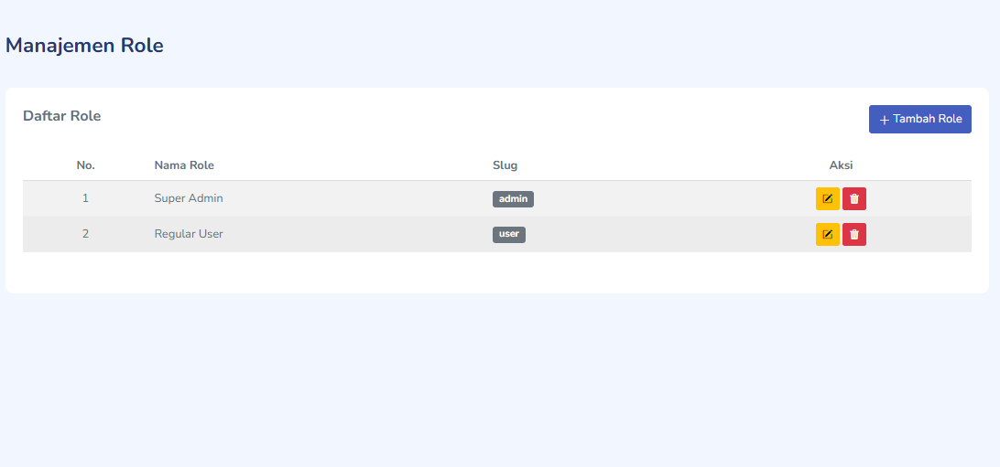
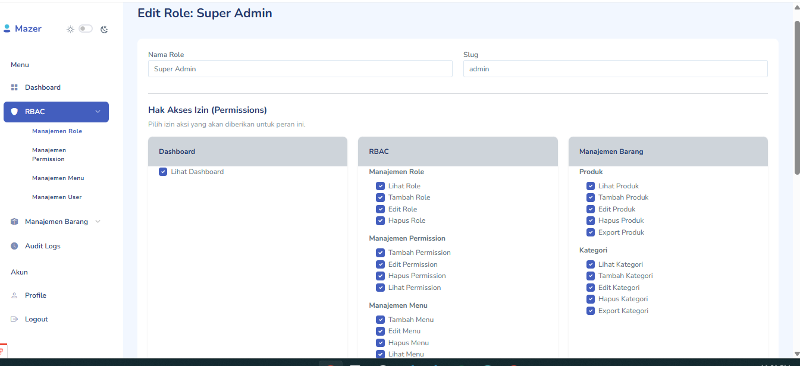
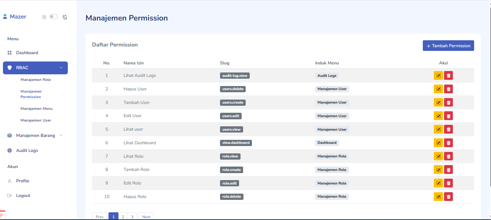
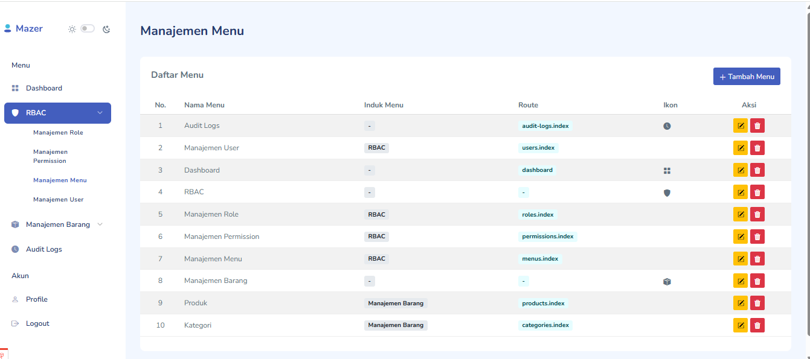
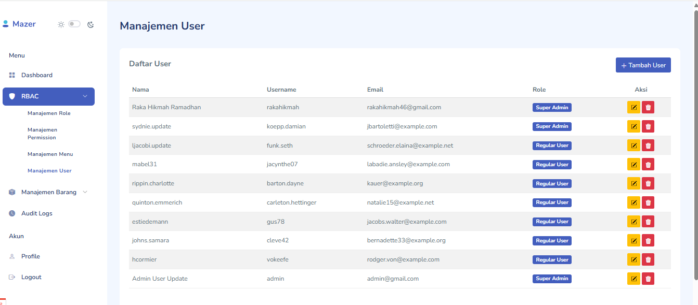
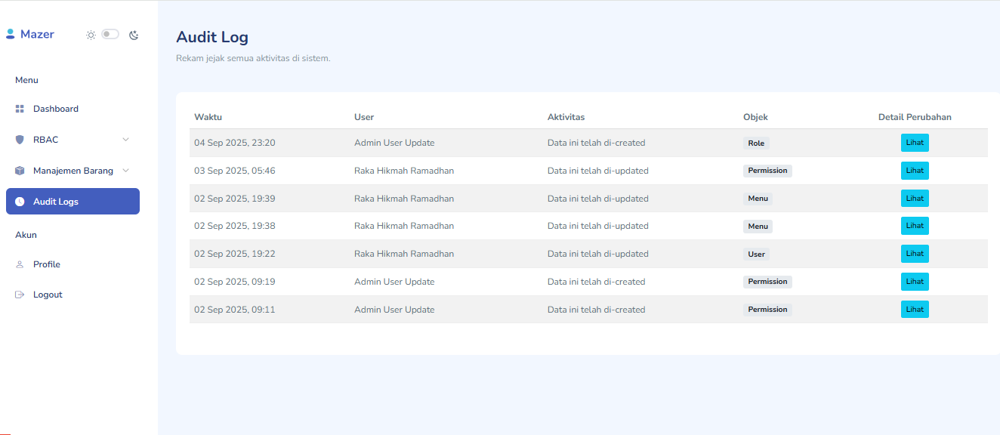

# Laravel Admin Starter Kit 🚀

Sebuah starter kit admin dashboard yang dibangun menggunakan **Laravel 12** untuk mempercepat proses pengembangan proyek Anda. Proyek ini dirancang dengan pendekatan yang jelas dan *straightforward*, sehingga mudah dipahami bahkan oleh developer yang baru memulai dengan Laravel.

Sangat cocok digunakan untuk berbagai kebutuhan, mulai dari proyek internal **kantor**, proyek **freelance**, **tugas akhir/skripsi**, hingga sebagai fondasi untuk proyek skala besar lainnya.

---

## ✨ Fitur Utama

Modul-modul dasar yang paling sering dibutuhkan dalam pengembangan aplikasi sudah tersedia dan siap pakai:

* **Manajemen Autentikasi**: Sistem login yang aman untuk melindungi halaman admin Anda.
* **Manajemen Profil**: Halaman khusus bagi setiap pengguna untuk memperbarui data pribadi mereka (nama, username, email, dan password) dengan aman.
* **Role-Based Access Control (RBAC) Lengkap**:
    * **Manajemen Role**: Buat, baca, perbarui, dan hapus *role* (jabatan) dengan mudah melalui antarmuka.
    * **Manajemen Permission**: Atur izin atau wewenang untuk setiap aksi (misalnya `product.create`, `user.delete`).
    * **Hak Akses Dinamis**: Tetapkan *permission* dan akses menu yang spesifik untuk setiap *role*.
    * **Relasi User-Role**: Setiap pengguna dapat diberi satu peran spesifik yang menentukan hak akses mereka di seluruh aplikasi.
* **Manajemen Menu Dinamis**:
    * Sidebar navigasi sepenuhnya dikontrol dari database.
    * Mendukung hingga 2 level menu (menu induk dan sub-menu).
    * Menu yang tampil akan otomatis menyesuaikan dengan hak akses *role* pengguna yang sedang login.
* **Audit Trail (Jejak Audit)**:
    * Komponen penting untuk melacak semua aktivitas di dalam sistem.
    * Mencatat setiap aksi (Create, Update, Delete), lengkap dengan detail perubahan dan siapa yang melakukannya.
* **Otorisasi via Laravel Gates**:
    * Sistem izin diimplementasikan menggunakan `Gate` bawaan Laravel, yang terhubung langsung dengan *permission* di database.
* **Querying Fleksibel**:
    * Dibangun di atas **Eloquent ORM** Laravel, namun Anda tetap bisa menggunakan **Query Builder** jika dibutuhkan.

---

## 🛠️ Teknologi yang Digunakan

* **Backend**: Laravel 12
* **Frontend**: Mazer Admin Dashboard (Bootstrap 5)
* **Interaktivitas**: Alpine.js (terintegrasi global)

---

## 🚀 Panduan Instalasi

Berikut adalah langkah-langkah untuk menjalankan proyek ini di lingkungan lokal Anda.

1.  **Clone Repositori**
    ```bash
    git clone https://github.com/rakahikmah/laravel-starter-kit
    cd nama-folder-proyek
    ```

2.  **Instal Dependensi Composer**
    ```bash
    composer install
    ```

3.  **Setup File `.env`**
    Salin file `.env.example`, lalu *generate* kunci aplikasi.
    ```bash
    cp .env.example .env
    php artisan key:generate
    ```
    Setelah itu, buka file `.env` dan sesuaikan konfigurasi database Anda (`DB_DATABASE`, `DB_USERNAME`, `DB_PASSWORD`).

4.  **Setup Database**
    *  Impor file `laravel_starter_kit.sql` yang sudah disediakan ke dalam *database manager* Anda (misalnya phpMyAdmin atau DBeaver atau lainnya).


5.  **Jalankan Aplikasi**
    Gunakan `php artisan serve` atau *virtual host* dari Laragon, XAMPP, atau Docker.
    ```bash
    php artisan serve
    ```
    Aplikasi Anda akan berjalan di `http://127.0.0.1:8000`.

---

## 🔑 Akun Default

Setelah instalasi selesai, Anda bisa login menggunakan akun admin bawaan:
* **Email**: `admin@gmail.com`
* **Password**: `password`

---

## 📸 Tampilan Aplikasi


 





---

## 💡 Eksplorasi & Pengembangan Lanjutan

Starter kit ini adalah fondasi yang kokoh. Anda sangat dianjurkan untuk mengeksplorasi dan mengembangkannya lebih jauh dengan teknologi lain seperti:
* jQuery
* Livewire
* Inertia.js dengan Vue atau React

---

## 🙏 Ucapan Terima Kasih

Tampilan admin dashboard ini menggunakan *template open-source* **Mazer** yang luar biasa. Terima kasih kepada **Ahmad Saugi** atas karyanya.
* **Repositori Mazer**: [https://github.com/zuramai/mazer](https://github.com/zuramai/mazer)
* **Dokumentasi**: [https://zuramai.github.io/mazer/](https://zuramai.github.io/mazer/)

---

## 📬 Kontak

Semoga *starter kit* ini bisa membantu Anda. Jika ada pertanyaan atau masukan, boleh langsung hubungi saya aja
* **Email**: [rakahikmah46@gmail.com](mailto:rakahikmah46@gmail.com)
* **LinkedIn**: [https://www.linkedin.com/in/rakahikmahramadhan/](https://www.linkedin.com/in/rakahikmahramadhan/)

---

## 📄 Lisensi
Copyright © 2025 **Raka Hikmah Ramadhan**. Proyek ini dilisensikan di bawah [MIT License](LICENSE.md).
